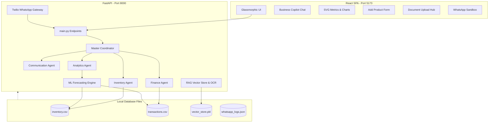

# AegisAI: Autonomous Multilingual Business Copilot 🛡️💼

AegisAI is an autonomous, multilingual business copilot designed to empower Indian Small and Medium Enterprises (SMEs). It provides merchants with intelligent financial summaries, stock depletion audits, machine-learning-driven sales forecasting, and document scanning (OCR) via a modern, dark glassmorphic web dashboard and a real-time Twilio WhatsApp gateway.

---

## 🚀 Key Features

*   **Financial KPI Monitors:** High-fidelity tracking of Total Sales, Outflows, Net Profits, and low-stock alerts.
*   **Predictive Analytics:** ML-driven 30-day sales predictions visualized using lightweight, custom SVG line charts, alongside revenue distribution rings.
*   **Stock Control:** Visual safety thresholds, depletion horizon calculations, and an automated WhatsApp notification manager to notify suppliers or warn merchants.
*   **Document Ingestion Hub (RAG):** Multi-modal data extraction from supplier invoices (OCR), speech logs (Speech-to-Text), and receipts using Gemini APIs and NumPy semantic search.
*   **Multi-Agent Coordination:** A coordinator that dynamically routes user queries to specialized agents (**Finance**, **Inventory**, **Analytics**, **Communication**) or runs a local data-driven fallback engine when offline.
*   **Bilingual Capability:** Fully supports conversational queries in **English** and **Tamil** (`தமிழ்`).
*   **WhatsApp Sandbox Console:** A live simulation playground to test WhatsApp webhook and bot flows from the web UI.

---

## 🏗️ System Architecture

AegisAI utilizes a decoupled architecture containing a Python FastAPI backend and a React (Vite) single-page frontend.



---

## 🛠️ Technology Stack

### Frontend
*   **Framework:** React (Vite-based Single Page Application)
*   **Styling:** Modern Dark Glassmorphism, smooth CSS transitions, and responsive grid layouts.
*   **Icons:** Lucide React
*   **Visualizations:** Custom lightweight SVG charts (no heavy external charting libraries needed).

### Backend
*   **Framework:** FastAPI (Uvicorn server)
*   **Data Analysis:** Pandas, NumPy
*   **Machine Learning:** Scikit-Learn (Linear Regression model for time-series trend fitting)
*   **AI Models:**
    *   **Google Gemini 1.5 Flash** (Text and multimodal OCR/STT processing)
    *   **Google Text-Embedding-004** (Document vectorization)
    *   **Llama 3.3 70B via Groq** (As a failover/failback model)
*   **Gateway:** Twilio WhatsApp Webhooks

---

## 📂 Project Structure

```
AegisAI/
├── agents/                 # Specialized Agent Definitions
│   ├── coordinator.py      # Master coordinator routing queries
│   ├── base_agent.py       # Core base agent setup
│   ├── analytics_agent.py  # Sales velocity and forecasting insights
│   ├── finance_agent.py    # Revenue, margins, and cost audits
│   ├── inventory_agent.py  # Stock counts, safety bounds, supplier details
│   └── communication_agent.py # WhatsApp text copy drafts
├── dashboard/              # Dashboard utility charts
├── data/                   # Local CSV and pickleshared databases
│   ├── inventory.csv       # Current inventory database
│   ├── transactions.csv    # 180-day sales/expenses ledger
│   ├── vector_store.pkl    # Vectorized chunks from RAG uploads
│   └── whatsapp_logs.json  # Webhook logs
├── forecasting/            # ML sales predictor pipeline
├── frontend/               # Vite-React Single Page App
├── rag/                    # Embedding extraction & retriever routines
├── uploads/                # Directory storing raw RAG PDFs and files
├── whatsapp/               # Twilio WhatsApp chatbot handlers
├── main.py                 # FastAPI backend server routes
├── requirements.txt        # Python backend package requirements
└── .env                    # Local credential parameters (Ignored by Git)
```

---

## ⚙️ Setup & Installation

### 1. Prerequisites
Ensure you have the following installed on your machine:
*   Python 3.10+
*   Node.js 18+ (and npm)

### 2. Backend Setup
1. Clone the repository and navigate to the project directory.
2. Install Python dependencies:
   ```bash
   pip install -r requirements.txt
   ```
3. Create a `.env` file in the root directory and add your API keys:
   ```env
   GROQ_API_KEY=your_groq_api_key
   GEMINI_API_KEY=your_gemini_api_key
   TWILIO_ACCOUNT_SID=your_twilio_sid
   TWILIO_AUTH_TOKEN=your_twilio_token
   TWILIO_WHATSAPP_NUMBER=whatsapp:+14155238886
   USER_WHATSAPP_NUMBER=your_whatsapp_number
   WHATSAPP_DEFAULT_COUNTRY_CODE=+91
   ```
4. Run the backend server:
   ```bash
   python main.py
   ```
   The backend will start at `http://localhost:8000`.

### 3. Frontend Setup
1. Navigate to the `frontend/` directory:
   ```bash
   cd frontend
   ```
2. Install dependencies:
   ```bash
   npm install
   ```
3. Start the Vite development server:
   ```bash
   npm run dev
   ```
   The frontend will run on `http://localhost:5173`.

---

## 🤖 Multi-Agent Pipeline & Fallback Routine

### Router-Executor Pattern
1.  **Semantic Vector Ingestion:** Inbound user questions lookup context matching uploaded PDF invoices.
2.  **Coordinator Routing:** The `Coordinator` analyzes the query and routes it to the designated specialized agent.
3.  **Context Injection:** In real-time, the Coordinator pulls records from `inventory.csv` or `transactions.csv` to enrich the agent's prompt template.
4.  **Specialized Prompt Execution:** The designated agent executes with Gemini/Groq, compiling formatted Markdown tables or summary lists.

### Offline Local Fallback
If API keys are missing or a connection error occurs, the backend falls back to local computations:
*   **Regex Router:** Matches query patterns to the correct agent area.
*   **Pandas Execution:** Parses the CSV files directly, computing margins, low stock items, and forecasting trajectories entirely locally, sending a complete response back to the client.
