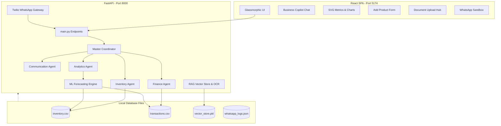
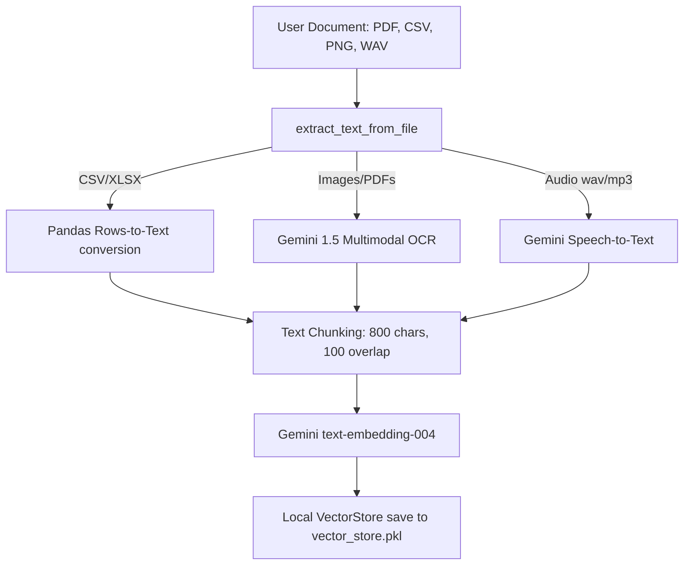

# AegisAI System Architecture & Technical Specifications

AegisAI is an autonomous, multilingual business copilot designed for Indian Small and Medium Enterprises (SMEs). It provides merchants with intelligent financial summaries, stock depletion audits, ML-driven sales forecasting, and document scanning (OCR) via a dark glassmorphic web dashboard and a real-time Twilio WhatsApp gateway.

---

## 1. Core Technology Stack

The application is built on a decoupled architecture containing a Python FastAPI backend and a React (Vite) single-page frontend.



### Frontend Stack
*   **Framework**: React (Vite-based SPA)
*   **Styling**: Custom CSS (Vanilla CSS variables) for Dark Glassmorphism, animations, and responsive screen-locked grids.
*   **Icons**: Lucide React
*   **Visualizations**: Custom responsive SVG charts (Forecast Line Chart, Payment Modes Ring, Product Safety Bar Graphs) to avoid bulky charting library dependencies.

### Backend Stack
*   **Framework**: FastAPI with Uvicorn server, CORS middleware, and form post processing.
*   **Data Science**: Pandas, NumPy.
*   **Machine Learning**: Scikit-Learn (LinearRegression model).
*   **AI Integration**: `google-generativeai` SDK (Gemini 1.5 Flash, Text-Embedding-004), direct requests payload (Groq Llama 3.3 70B Versatile).
*   **SMS Gateway**: Twilio.

---

## 2. Local Database & File Structures

AegisAI operates entirely on a local database layer containing CSV files, JSON logs, and pickleshards:

### A. Inventory Database: `data/inventory.csv`
Contains the warehouse stock levels, cost bases, and supplier records.
```csv
ProductID,ProductName,Category,StockLevel,ReorderLevel,UnitPrice,RetailPrice,Supplier
P101,Premium Basmati Rice 5kg,Grains,45,15,350.0,450.0,Sri Balaji Traders
P102,Gold Winner Sunflower Oil 1L,Oils,8,20,110.0,140.0,Vignesh Wholesalers
```

### B. Transactions Ledger: `data/transactions.csv`
Contains a historical record of all sales (revenue streams) and business outflows (operating costs, restocking, utility bills) over the past 180 days.
```csv
Date,TransactionID,ProductID,ProductName,Category,Quantity,Price,Type,Amount,PaymentMode
2026-05-01,TXN1001,P101,Premium Basmati Rice 5kg,Grains,2,450.0,Sale,900.0,UPI
2026-05-01,TXN_RENT_052026,EXP_RENT,Shop Rent Payment,Operations,1,12000.0,Expense,12000.0,UPI
```

### C. Vector Database: `data/vector_store.pkl`
A pickleshard containing text chunks, embedding vectors, and metadata tables extracted from supplier bills, ledger logs, and voice transcripts.
*   **Documents Structure**: `[ {"text": str, "embedding": list[float], "metadata": dict} ]`

### D. WhatsApp Logs Database: `data/whatsapp_logs.json`
A JSON array logging inbound merchant webhook messages and outbound automated stock warning history.
*   **Schema**: `[ {"timestamp": str, "to": str, "body": str, "status": str} ]`

---

## 3. Machine Learning & Forecasting Engine

The analytics dashboard and agents use Scikit-Learn to fit forecasting trends:

*   **Linear Regression Model**: A `LinearRegression` model fits historical sales data aggregated by date.
*   **Features Engine**:
    *   `DayIndex` (Time-series trend parameter).
    *   `DayOfWeek` (One-hot encoded values representing weekday/weekend buyer cycles).
*   **Inventory Velocity Calculation**:
    $$\text{Sales Velocity} = \frac{\text{Quantity Sold (Last 30 Days)}}{30}$$
*   **Depletion Horizon Projection**:
    $$\text{Days Remaining before Exhaustion} = \frac{\text{Current Stock Level}}{\text{Sales Velocity}}$$
*   **Safety Threshold Alerts**:
    *   `Low Stock`: Current stock is less than or equal to the defined `ReorderLevel`. Recommended restock is calculated to cover **45 days** of sales velocity.
    *   `Approaching Outage`: Stock levels are healthy, but depletion formulas predict stock depletion within **10 days**. Recommended restock covers **30 days** of sales velocity.

---

## 4. RAG (Retrieval-Augmented Generation) Pipeline

When parsing text, images, or audio files, AegisAI extracts context chunks and indexes them:



### Similarity Search
Cosine similarity is computed between the query embedding and the stored document embedding vectors using Numpy:
$$\text{Cosine Similarity} = \frac{\mathbf{A} \cdot \mathbf{B}}{\|\mathbf{A}\| \|\mathbf{B}\|}$$
Top $k=3$ results with similarity scores higher than $0.1$ are consolidated and injected into the prompt.

---

## 5. Multi-Agent Coordinator & Routing

The chat system uses a multi-agent coordinator configuration to orchestrate tasks across 4 specialized agents.

```mermaid
sequenceDiagram
    participant Merchant as User / Merchant
    participant Main as main.py API
    participant Coord as Coordinator Agent
    participant RAG as Vector Index
    participant DB as CSV databases
    participant Special as Specialized Agent
    participant LLM as Gemini / Groq API

    Merchant->>Main: Query (Chat / Webhook)
    Main->>RAG: retrieve_context(query)
    RAG-->>Main: context snippets
    Main->>Coord: coordinate_agents(query, context)
    
    Coord->>LLM: COORDINATOR_SYSTEM_INSTRUCTION + query
    Note over Coord,LLM: Routes to FINANCE, INVENTORY,<br/>ANALYTICS, or COMMUNICATION
    LLM-->>Coord: Selected Agent Designation
    
    rect rgb(30, 41, 59)
        Note over Coord,Special: Coordinator queries active CSV database details
        Coord->>DB: Load CSV Data (Stock velocity / Ledger Profit)
        DB-->>Coord: Structured DB context summary
    end
    
    Coord->>Special: Run selected agent (combined DB + RAG context)
    Special->>LLM: SYSTEM_INSTRUCTION + prompt context
    LLM-->>Special: Formatted Markdown response text
    Special-->>Coord: Final Response Text
    Coord-->>Main: Coordinator Payload Dict
    Main-->>Merchant: Dynamic Chat Bubble Response
```



### Specialized Agents Descriptions
1.  **Finance Agent**: Analyzes transaction variables (revenue, costs, UPI-to-Cash ratios) and highlights spike expenses like rent or power bills.
2.  **Inventory Agent**: Evaluates stock levels, identifies safety warnings, suggests reorder amounts, and retrieves supplier contacts.
3.  **Analytics Agent**: Explains machine learning coefficients, growth indexes, and sales velocity trends in simple, non-technical terms.
4.  **Communication Agent**: Drafts copy optimized for WhatsApp mobile screens with appropriate emojis.

---

## 6. Every Single System Feature

*   **Financial KPI Monitors**: Highlights Total Sales, Outflows, Net Profits, and low stock warnings.
*   **Predictive Analytics Tab**: Visualizes 30-day sales predictions using custom SVG line charts, alongside revenue distribution rings.
*   **Stock Control Tab**: Shows bar charts of safety limits vs stock levels, displays velocity depletion tables, and has an Alert Manager to send WhatsApp warnings.
*   **Add Product Form widget**: Appends validated product fields directly to `inventory.csv` and updates all UI views in real-time.
*   **Document Hub**: Ingests bills (OCR) and voice logs (transcription) into the RAG vector database.
*   **WhatsApp Sandbox Console**: Simulates mobile chat interactions.
*   **Bilingual Translation**: Fully supports Tamil and English queries.
